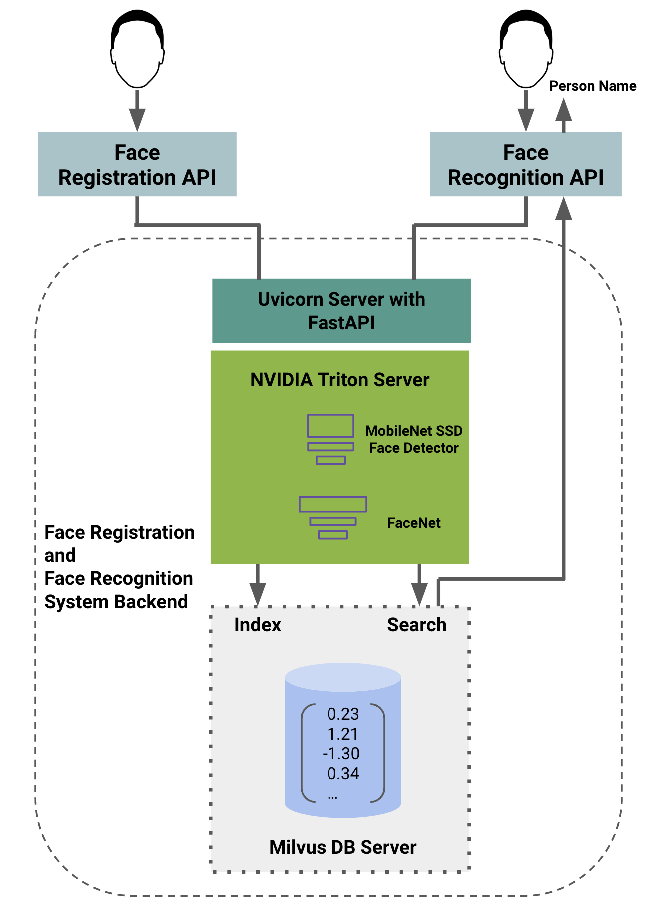

# Face Registration and Recognition Backend System with uvicorn, fastapi, and milvus


Tested with `docker-compose version 1.29.2`.

Backend system for detecting and saving a face from an image into a vectorized milvus database for running facial recognition on images. (Note: currently only one face per image is supported for both face registration and lookup).



-   [milvus official setup reference](https://milvus.io/docs/install_standalone-docker.md)

## Setup

### Download model weights

```bash
python3 -m venv venv
source venv/bin/activate
# inside venv/virtualenv/conda
pip install gdown
# download model weights
gdown 18dH0l6ESMaHJo3tFMySt0I8LsKcCss3o
unzip models.zip -d app_docker_compose/app/triton_server
rm models.zip
```

### Create env file

Create a `.env` file inside `app_docker_compose` based on the following parameters with necessary variables replaced:

    # milvus
    MILVUS_HOST=standalone
    MILVUS_PORT=19530
    # mysql mariadb
    MYSQL_ROOT_PASSWORD=admin
    MYSQL_DATABASE=default
    MYSQL_USER=admin
    MYSQL_PASSWORD=admin
    # phpmyadmin mariadb
    PMA_HOST=mysql
    PMA_PORT=3306
    PMA_USER=admin
    PMA_PASSWORD=admin
    # redis
    REDIS_PORT=6379

## Setup with Docker Compose for Deployment

**Start uvicorn and triton server with a milvus instance for face vector storage & search**

Note, an easier way to use later versions of docker-compose is to install the pip package with `pip install docker-compose` in a venv

```shell
cd app_docker_compose
# build all required containers
docker-compose build
# start all services
docker-compose up -d
```

## Setup with Docker for Development

**Allows for rapid prototyping.**

Change into main working directory where all subsequent commands must be run.

```shell
cd app_docker_compose 
```

### Build docker

```shell
bash scripts/build_docker.sh
```

### Local Uvicorn requirements

```bash
# setup virtual env (conda env is fine as well)
python -m venv venv
source venv/bin/activate
# install all reqs
pip install --upgrade pip
pip install -r requirements.txt
```

### Run servers

#### Start milvus vector database server

```shell
# clear all stopped containers
docker container prune
# start milvus vector database server with docker-compose
docker-compose up -d etcd minio standalone
# check milvus server status with
docker-compose ps
```

#### Start face model triton=server

```shell
# start triton-server in a docker container exposed onport 8081
docker run -d --rm -p 0.0.0.0:8081:8081 --name uvicorn_trt_server face_recog:latest tritonserver --model-store app/triton_server/models --allow-grpc=true --allow-http=false --grpc-port=8081
# check trtserver status with
docker logs uvicorn_trt_server
```
#### run uvicorn server

```shell
python3 app/server.py -p EXPOSED_HTTP_PORT
```

### TO-DO

-   Add use of mysql to store faces and redis for a cached-access of data
-   Setup with GitHub Actions for automatic testing

### Running tests

```shell
cd app_docker_compose
pip install -r requirements.txt
pip install -r tests/requirements.txt
docker-compose up -d etcd minio standalone
docker run -d --rm -p 0.0.0.0:8081:8081 --name uvicorn_trt_server face_recog:latest tritonserver --model-store app/triton_server/models --allow-grpc=true --allow-http=false --grpc-port=8081
pytest tests
````

#### Notes on docker-compose yml setup

Note if services other than the uvicorn web-api are to be exposed such as the milvus or minio servers, alter the `expose` options to published `ports` for access outside the docker containers.

    expose:
      - "9001"

    ports:
      - "9001:9001"

For `docker-compose version 1.29.2` and `yaml version 3.9`, `mem_limit` can be used with `docker-compose up`:

    mem_limit: 512m

For `docker-compose version <1.29.2` and `yaml version <3.9`, the following deploy setup can be used with `docker-compose --compatibility up`:

    deploy:
      resources:
        limits:
          memory: 512m

#### Notes on triton-server

Check saved.model inputs/outputs with `$ saved_model_cli show --dir savemodel_dir --all` after installing tensorflow.

Options for CPU and GPU based models for tritonserver:

    # CPU mode
    instance_group [
        {
          count: 1
          kind: KIND_CPU
        }
      ]

    # GPU mode
    instance_group [
        {
          count: 1
          kind: KIND_GPU
          gpus: [ 0 ]
        }
      ]

### Acknowledgements

-   milvus
-   triton-server
-   uvicorn
-   fastapi
